# Launch to the AWS

Deploy Django Application to AWS EC2 or Lightsail (Ubuntu 18.04)


## Settings before deploy

- Environment Variables
    - `python-decouple`
        ```bash 
        $ pip install python-decouple
        ```
    - `.env`
        ```bash
        # .env
        SECRET_KEY='...'
        ...
        ```
    - `settings.py`
        ```python
        # settings.py
        from decouple import config # 추가
        
        SECRET_KEY = config('SECRET_KEY')
        ```

- ALLOWED_HOSTS
    - public IP들은 인스턴스 생성 후에 알 수 있으므로, 사용하게 될 경우 나중에 추가.
        ```python
        ALLOWED_HOSTS = [
        	'.compute.amazonaws.com',
        	'[EC2_INSTANCE_PUBLIC_IP]',
        	'[LIGHTSAIL_INSTANCE_PUBLIC_IP]',
        ]
        ```

- staticfiles
    ```python
    STATIC_ROOT = os.path.join(BASE_DIR, 'staticfiles')
    ```

# Create Server on AWS

Choose one, but **Lightsail** is recommanded

## EC2

### 인스턴스 생성

- EC2 대시보드로 이동
    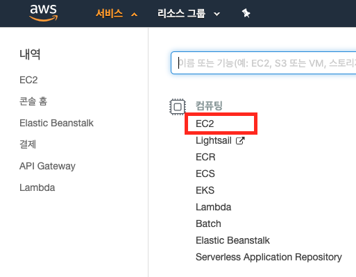
- 인스턴스 생성
    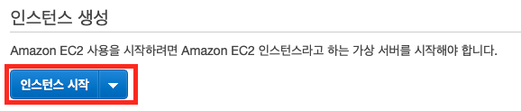
    - 단계1: OS 선택 - ubuntu 18.04
        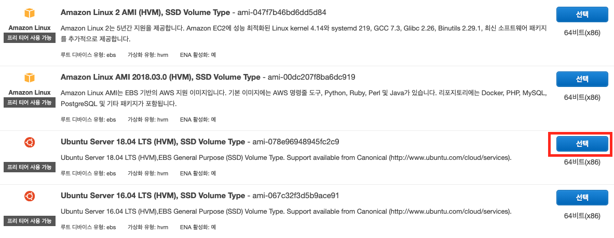
    - 단계2: t2.micro
        
    - 단계 3, 4, 5는 기본 설정 사용
    - 단계 6: 보안 그룹 구성
        - HTTP 추가
            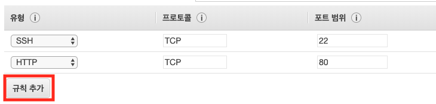
        - `검토 및 시작` → `시작하기`
        - Key Pair 설정
            - 이름 설정 후, 다운로드 버튼 → 그래야 인스턴스 시작 버튼 활성화 됨.
            - **(주의)** pem은 외부에 유출되어서는 안됨. 우리가 만든 인스턴스에 접속할 수 있는 열쇠 같은 것임! 절대로 GitHub이나 온라인 상의 Public한 위치에 업로드 하지 말 것!
            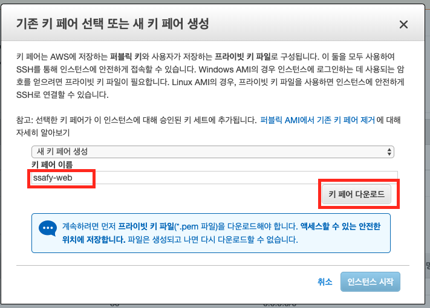
    - 인스턴스 생성 확인
        - 생성 중
            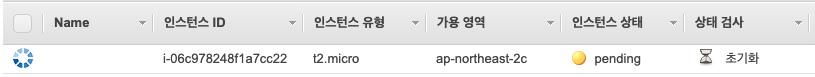
        - 생성 완료
            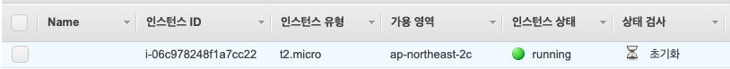
    - 다운로드 받은 pem

### 인스턴스 접속
- Windows
    - puttygen
        - pem → ppk
    - putty
        - ppk 사용하여 접속!
- Mac
    - ssh
        - pem 사용하여 접속!

## Lightsail

### 인스턴스 생성

- Lightsail 대시보드로 이동
    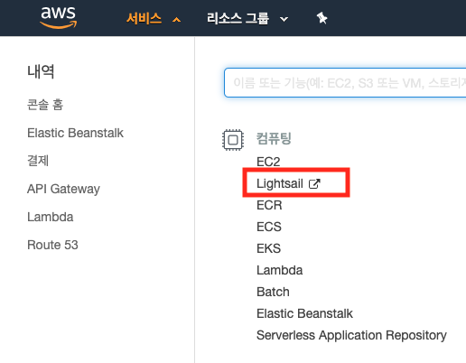
- 인스턴스 생성
    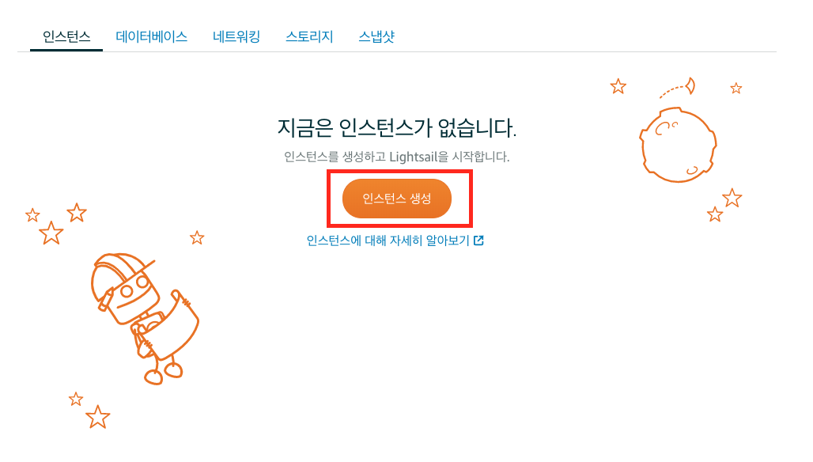
    - 인스턴스 위치
        
        - 인스턴스 이미지
            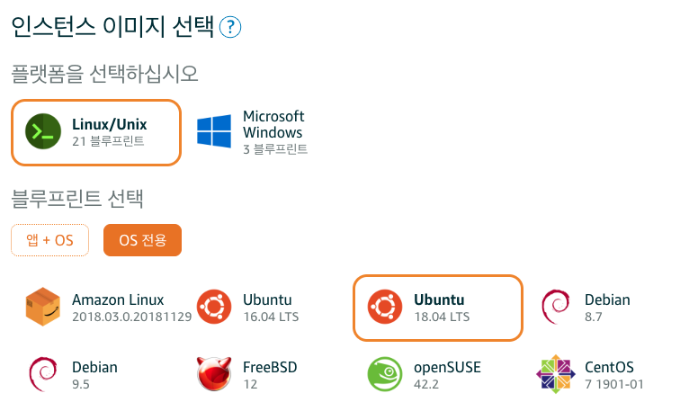
        - 인스턴스 식별(이름) (Optional)
            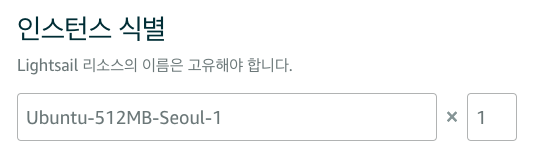
        - 인스턴스 생성!
            - 생성 중
                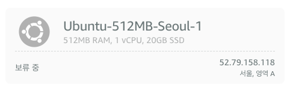
            - 생성 완료
                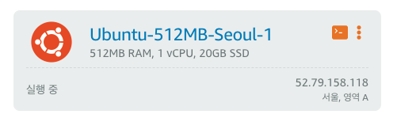

### 인스턴스 접속
- 웹 상에서 접속
    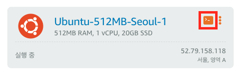

# On Server

## pyenv, pyenv-virtualenv 설치

- Dependency 설치
    ```bash
    sudo apt-get update
    sudo apt-get install -y make build-essential libssl-dev zlib1g-dev libbz2-dev \
    libreadline-dev libsqlite3-dev wget curl llvm libncurses5-dev libncursesw5-dev \
    xz-utils tk-dev libffi-dev liblzma-dev python-openssl
    ```

- pyenv & pyenv-virtualenv
    ```bash
    git clone https://github.com/pyenv/pyenv.git ~/.pyenv
    echo 'export PYENV_ROOT="$HOME/.pyenv"' >> ~/.bashrc
    echo 'export PATH="$PYENV_ROOT/bin:$PATH"' >> ~/.bashrc
    echo -e 'if command -v pyenv 1>/dev/null 2>&1; then\n  eval "$(pyenv init -)"\nfi' >> ~/.bashrc
    exec "$SHELL"
    
    git clone https://github.com/pyenv/pyenv-virtualenv.git $(pyenv root)/plugins/pyenv-virtualenv
    echo 'eval "$(pyenv virtualenv-init -)"' >> ~/.bashrc
    exec "$SHELL"
    ```

- python 설치
    ```bash
    pyenv install 3.7.3
    pyenv global 3.7.3
    python -V
    #=> Python 3.7.3
    ```

## Clone Project

- git clone
    ```bash
    git clone [PROJECT_REPO_URL]
    ```

- virtualenv 생성
    ```bash
    pyenv virtualenv [VENV_NAME]
    ```

- virtualenv 활성화
    ```bash
    cd [PROJECT_DIR_NAME]
    pyenv local [VENV_NAME]
    ```

## uWSGI, nginx 설정

- uwsgi 설치
    - 가상환경 안에서
    ```bash
    (...-venv) $ pip install uwsgi
    ```

- nginx 설치
    ```bash
    sudo apt-get update
    sudo apt-get install software-properties-common
    sudo apt-get install nginx
    ```

- uwsgi 설정이 저장되는 폴더 프로젝트 내부에 생성
    ```bash
    mkdir tmp
    mkdir log
    ```

- `.gitignore`
    - uwsgi 설정 파일이랑 log 파일 위치를 프로젝트 내로 잡아주기 때문에 설정함.
    ```
    tmp
    log
    ```

- nginx 설정
    - sudo vi /etc/nginx/sites-enabled/default
    ```
    server_name *.compute.amazonaws.com;
    
    location / {
    		uwsgi_pass unix:///home/ubuntu/[PROJECT_DIR_NAME]/tmp/[PROJECT_DIR_NAME].sock;
    		include uwsgi_params;
    }
    ```

## uWSGI

- `.config/uwsgi/[PROJECT_DIR_NAME].ini`
    - uwsgi로 서버 돌리기 위한 설정 파일
    - 로컬 프로젝트에서 만들어서 git push
    ```
    [uwsgi]
    chdir = /home/ubuntu/[PROJECT_DIR_NAME]
    module = [PROJECT_NAME].wsgi:application
    home = /home/ubuntu/.pyenv/versions/[VENV_NAME]
    
    uid = ubuntu
    gid = ubuntu
    
    socket = /home/ubuntu/[PROJECT_DIR_NAME]/tmp/[PROJECT_DIR_NAME].sock
    chmod-socket = 666
    chown-socket = ubuntu:ubuntu
    
    enable-threads = true
    master = true
    vacuum = true
    pidfile = /home/ubuntu/[PROJECT_DIR_NAME]/tmp/[PROJECT_DIR_NAME].pid
    logto = /home/ubuntu/[PROJECT_DIR_NAME]/log/uwsgi/@(exec://date +%%Y-%%m-%%d).log
    log-reopen = true
    ```

- uwsgi daemon 등록
    - `uwsgi.service`
        ```
        [Unit]
        Description=uWSGI Service
        After=syslog.target
        
        [Service]
        User=ubuntu
        ExecStart=/home/ubuntu/.pyenv/versions/[VENV_NAME]/bin/uwsgi -i /home/ubuntu/[PROJECT_DIR_NAME]/.config/uwsgi/[PROJECT_DIR_NAME].ini
        
        Restart=always
        KillSignal=SIGQUIT
        Type=notify
        StandardError=syslog
        NotifyAccess=all
        
        [Install]
        WantedBy=multi-user.target
        ```

    - 심볼릭 링크를 `/etc/systemd/system/` 안에 생성해 준다.
        ```
        sudo ln -s ~/[PROJECT_DIR_NAME]/.config/uwsgi/uwsgi.service /etc/systemd/system/uwsgi.service
        ```
    - daemon 등록
        ```bash
        # daemon reload
        sudo systemctl daemon-reload
        
        # uswgi daemon enable and restart
        sudo systemctl enable uwsgi
        sudo systemctl restart uwsgi.service
        
        # check daemon
        sudo systemctl | grep nginx
        sudo systemctl | grep uwsgi
        ```

## Migrate

- DB migrate
    ```bash
    ./manage.py migrate
    ```

- createsuperuser
    ```bash
    ./manage.py createsuperuser
    ```

## Static Files

- `.gitignore`
    ```
    staticfiles
    ```

- 서버에서 collect static
    ```bash
    python manage.py collectstatic
    ```

- /etc/nginx/sites-enabled/default
    - 아래 내용 추가
    ```
    location /static/ {
        alias /home/ubuntu/[PROJECT_DIR_NAME]/staticfiles/;
    }
    ```

- restart
    ```bash
    sudo systemctl restart nginx
    sudo systemctl restart uwsgi
    ```

## Debug

- 프로젝트가 잘 동작하면, False로 바꿔준다.
    ```python
    DEBUG = False
    ```

## Domain

- 도메인을 구매해서 붙였다면, `ALLOWED_HOSTS`에 추가해주어야 한다.
